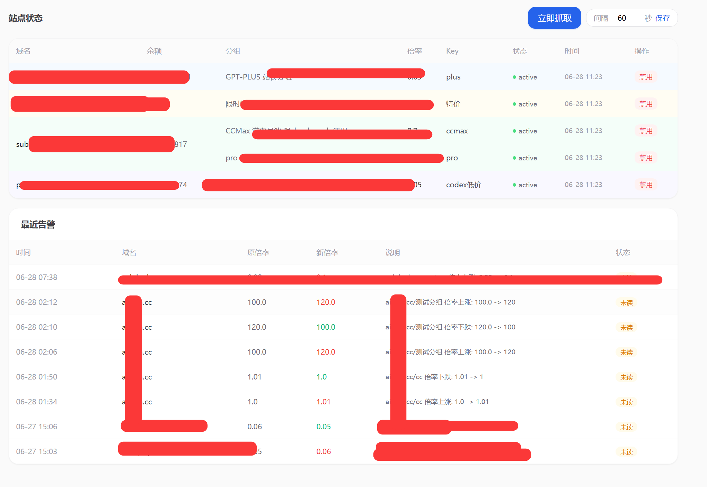

# 上游价格监控 (Price Monitor)

一个基于 **FastAPI** 的上游站点价格监控系统。自动抓取多个上游站点的 Key 信息（余额、倍率、状态），倍率变化时发送邮件告警，倍率上涨自动禁用 Key。

**目前只支持sub2api站点的监控   如果专属分组变化暂时监控不到，我抽时间改改。**

首次运行通过 **可视化 Setup 向导** 完成初始化，支持 PostgreSQL / SQLite，JWT 认证保护管理界面。

## 预览



## 联系


## 功能

| 功能 | 说明 |
|------|------|
| 多站点多 Key 抓取 | 支持多个上游站点，每个站点所有 Key 独立入库、独立告警 |
| 定时 + 手动抓取 | APScheduler 定时任务 + 页面一键抓取 |
| 抓取间隔可调 | 前端动态修改抓取间隔，实时生效无需重启 |
| 倍率变化告警 | 倍率变化时自动入库并发送 HTML 汇总邮件 |
| 倍率上涨自动禁用 | 倍率上涨自动调用上游 API 禁用 Key，下跌仅发邮件 |
| Token 持久化 | Token 缓存复用，避免每次抓取都登录 |
| 余额实时获取 | 不缓存余额，每次抓取通过 /api/v1/auth/me 实时获取 |
| 前端手动启停 Key | 监控页面支持手动启用/禁用上游 Key |
| 邮件通知 | SMTP 发送 HTML 格式告警邮件，支持中文 |
| 上海时区 | 所有时间统一使用 UTC+8 |
| 响应式界面 | Tailwind CSS 移动端 + 桌面端自适应，卡片 + 表格双视图 |
| Setup 向导 | 首次运行可视化初始化：配数据库 → 创管理员 → 可选加站点 |
| JWT 认证 | httpOnly Cookie + bcrypt 密码哈希，安全保护管理界面 |
| PostgreSQL / SQLite | 优先 PG，连接不通可降级本地 SQLite |

## 技术栈

| 层 | 技术 |
|---|------|
| 后端框架 | FastAPI + SQLModel |
| 调度器 | APScheduler (AsyncIOScheduler) |
| HTTP 客户端 | httpx (异步并发) |
| 模板引擎 | Jinja2 (服务端渲染) |
| 前端 | Tailwind CSS CDN (移动端响应式) |
| 数据库 | PostgreSQL / SQLite |
| 认证 | JWT (python-jose) + bcrypt |
| 邮件 | smtplib + MIME |

## 快速开始

### 1. 安装依赖

```bash
pip install -r requirements.txt
```

### 2. 启动服务

```bash
uvicorn app.main:app --reload
```

### 3. Docker 部署

```bash
docker compose up -d
```

或手动构建：

```bash
docker build -t price-monitor .
docker run -d --name price-monitor \
  -p 8081:8081 \
  -v $(pwd)/data:/app/data \
  -e TZ=Asia/Shanghai \
  price-monitor
```

`data/` 目录挂载到宿主机，持久化 `config.json` 和 SQLite 数据库。

### 4. 初始化

首次访问 `http://127.0.0.1:8081` 将自动跳转到 **Setup 向导**：

1. **配置数据库** — 分字段填写或粘贴 PostgreSQL 连接串，点"测试连接"；不通可降级 SQLite
2. **创建管理员** — 设置邮箱和密码
3. **初始化站点**（可选）— 填写上游站点域名、邮箱、密码

完成后将自动登录，后续访问 `/login` 输入管理员账号即可。

### 5. 检查

| 页面 | 地址 |
|------|------|
| 监控总览 | http://127.0.0.1:8081/ |
| 站点管理 | http://127.0.0.1:8081/sites |
| API 文档 | http://127.0.0.1:8081/docs |

## 配置

### 邮件配置

编辑 `app/config.py`，修改以下常量：

```python
SMTP_HOST = "smtp.qq.com"          # SMTP 服务器
SMTP_PORT = 587                    # 端口
SMTP_USER = "your_email@qq.com"    # 发件邮箱
SMTP_PASSWORD = "your_smtp_password"  # SMTP 授权码
SMTP_FROM = "PriceMonitor <your_email@qq.com>"
ALERT_EMAIL_TO = ["alert@example.com"]  # 告警接收人列表
```

### 抓取参数

```python
FETCH_INTERVAL_SECONDS = 300   # 默认抓取间隔（秒）
HTTP_TIMEOUT = 10              # 单请求超时（秒）
FETCH_CONCURRENCY = 10         # 并发抓取数
```

抓取间隔可在前端直接修改，无需重启。

## 项目结构

```
price-monitor/
├── app/
│   ├── main.py              # FastAPI 入口 + lifespan + 认证中间件
│   ├── config.py            # 邮件/抓取参数 + config.json 读写
│   ├── models.py            # SQLModel 表：User / Site / PriceSnapshot / Alert / Setting
│   ├── database.py          # 延迟初始化引擎，支持 PG / SQLite
│   ├── auth.py              # JWT 签发/验证 + bcrypt 密码哈希
│   ├── crud.py              # 数据库 CRUD 操作
│   ├── fetcher.py           # 上游 API 抓取：登录、Keys、余额、禁用
│   ├── scheduler.py         # APScheduler 定时任务 + 告警判定
│   ├── mail.py              # SMTP HTML 邮件发送
│   ├── routers/
│   │   ├── auth.py          # /login /logout
│   │   ├── setup.py         # /api/setup/test-db /api/setup/complete
│   │   ├── pages.py         # Jinja2 网页渲染
│   │   ├── sites.py         # 站点 CRUD API
│   │   └── monitor.py       # 监控数据 API + Key 启用/禁用
│   └── templates/
│       ├── base.html        # 布局基模板（桌面顶栏 + 移动端底部导航）
│       ├── index.html       # 监控总览（卡片 + 表格双视图）
│       ├── sites.html       # 站点管理
│       ├── login.html       # 登录页
│       └── setup.html       # 初始化向导
├── data/                    # 运行时数据（config.json 不纳入版本控制）
├── Dockerfile
├── docker-compose.yml
├── requirements.txt
└── README.md
```

## API

### 认证
| 方法 | 路径 | 说明 |
|------|------|------|
| GET | `/login` | 登录页 |
| POST | `/login` | 登录（email + password 表单） |
| GET | `/logout` | 退出登录 |

### 站点管理
| 方法 | 路径 | 说明 |
|------|------|------|
| GET | `/api/sites` | 列出所有站点 |
| POST | `/api/sites` | 新增站点 |
| GET | `/api/sites/{id}` | 查询站点 |
| PATCH | `/api/sites/{id}` | 更新站点 |
| DELETE | `/api/sites/{id}` | 删除站点 |

### 监控数据
| 方法 | 路径 | 说明 |
|------|------|------|
| POST | `/api/monitor/run` | 手动触发抓取 |
| GET | `/api/snapshots` | 历史快照 |
| GET | `/api/alerts` | 告警列表 |
| POST | `/api/alerts/{id}/ack` | 标记告警已读 |
| GET | `/api/monitor/version` | 快照计数（前端轮询用） |

### Key 操作
| 方法 | 路径 | 说明 |
|------|------|------|
| POST | `/api/keys/{site_id}/{key_id}/enable` | 启用 Key |
| POST | `/api/keys/{site_id}/{key_id}/disable` | 禁用 Key |

### 设置
| 方法 | 路径 | 说明 |
|------|------|------|
| GET | `/api/settings` | 获取所有设置 |
| PUT | `/api/settings/fetch-interval` | 更新抓取间隔 |

### 初始化
| 方法 | 路径 | 说明 |
|------|------|------|
| POST | `/api/setup/test-db` | 测试数据库连接 |
| POST | `/api/setup/complete` | 完成初始化 |

## License

MIT
